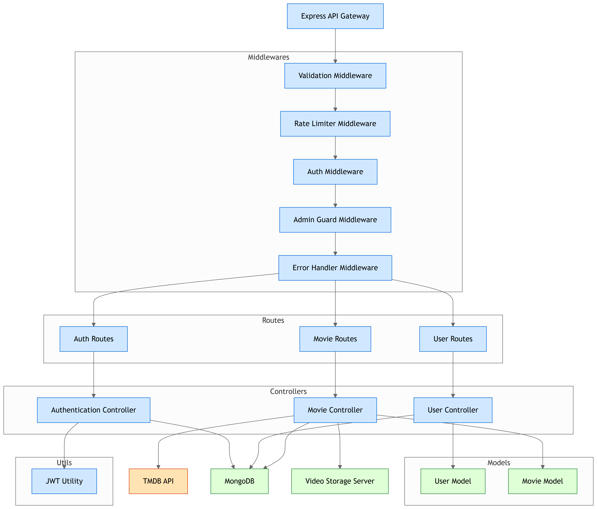

# HONG_MOVIES


# 🎬 Backend de la API de Películas

## 🚀 Visión General

Hola a todos. Hoy les quiero presentar mi proyecto de backend para una aplicación de películas, construido desde cero con Node.js y Express. El objetivo principal fue crear una API RESTful que fuera robusta, segura y fácil de mantener.

Para el desarrollo, seguí un enfoque modular, organizando el código en diferentes capas para separar responsabilidades. La base de datos que elegí fue MongoDB, gestionada a través de la librería Mongoose, la cual me permitió definir esquemas claros y estructurar mis datos.

Este es un **backend robusto** y **escalable** diseñado para una aplicación de películas, construido con **Node.js** y **Express**. La API permite gestionar películas y usuarios con diferentes niveles de acceso y un sistema de autenticación seguro.

## ✨ Características Principales

-   **Autenticación y Autorización**: Sistema de registro y login con JSON Web Tokens (JWT). Roles de usuario (`user`, `admin`, `superAdmin`) para control de acceso.
-   **Gestión de Películas**: Endpoints para crear, leer, actualizar y eliminar películas.
-   **Seguridad**:
    -   **Protección contra ataques de fuerza bruta**: Uso de `express-rate-limit`.
    -   **Protección de cabeceras HTTP**: Implementación de `helmet` para seguridad.
    -   **Encriptación de contraseñas**: Uso de `bcryptjs` para almacenar contraseñas de forma segura.
-   **Validación de Datos**: Validación de campos de entrada con `express-validator` para asegurar la integridad de los datos.
-   **Control de Logs**: Monitoreo de peticiones HTTP con `morgan`.
-   **Estructura Modular**: Código organizado en carpetas (`controllers`, `routes`, `models`, `middlewares`) para mantener la lógica separada y el proyecto fácil de mantener.

## ⚙️ Tecnologías Usadas

-   **Backend**: Node.js, Express.js
-   **Base de datos**: MongoDB (a través de Mongoose)
-   **Autenticación**: JSON Web Tokens (JWT), bcryptjs
-   **Middleware de seguridad**: Helmet, express-rate-limit
-   **Otros**: CORS, dotenv, morgan

## 📦 Instalación y Configuración

1.  **Clona el repositorio**:
    ```bash
    git clone https://github.com/Honcito/HONG_MOVIES.git
    cd backend
    ```

2.  **Instala las dependencias**:
    ```bash
    npm install
    ```

3.  **Configura las variables de entorno**:
    -   Crea un archivo `.env` en la raíz del proyecto.
    -   Añade las siguientes variables (ejemplo):
    ```env
    MONGO_URI=mongodb://localhost:27017/nombre-de-tu-db
    JWT_SECRET=tu_secreto_super_seguro
    PORT=3000
    ```

4.  **Ejecuta el servidor**:
    -   **Modo de desarrollo**: Para desarrollo con recarga automática:
        ```bash
        npm run dev
        ```
    -   **Modo de producción**: Para iniciar el servidor:
        ```bash
        npm start
        ```

☁️ Despliegue en Producción
Este backend está diseñado para ser desplegado en un entorno de producción utilizando Nginx como servidor proxy inverso y PM2 para la gestión de procesos.

¿Por qué Nginx y PM2?
Nginx: Actúa como un proxy inverso, distribuyendo el tráfico web a tu aplicación Node.js. Esto mejora el rendimiento, maneja las conexiones de forma más eficiente y permite servir archivos estáticos directamente.

PM2: Es un gestor de procesos para aplicaciones Node.js. Asegura que tu aplicación se mantenga en línea de forma continua, reiniciándola automáticamente si falla, y optimizando el uso de recursos.

No-IP: Para resolver el problema de tener una IP dinámica, configuré el servicio de DNS dinámico No-IP. Esto asocia un dominio (.ddns.net) a mi IP actual, garantizando que el backend sea siempre accesible desde cualquier lugar.

En este momento, el backend ya está desplegado y funcionando.

## 🗺️ Arquitectura y Estructura del Proyecto

La estructura del proyecto sigue un patrón MVC (Model-View-Controller) modificado, con rutas, controladores y modelos bien definidos.

├── src
│   ├── config                  # Conexión y configuración de la base de datos
│   ├── controllers             # Contiene la lógica de negocio de la API
│   ├── middlewares             # Funciones intermedias para autenticación y validación
│   ├── models                  # Los esquemas de Mongoose para la base de datos
│   ├── routes                  # Endpoints de la API
│   ├── server.js               # El punto de entrada principal
│   └── ...

Cada petición sigue un flujo predecible: un route la recibe, un middleware la valida y autentica, y finalmente un controller la procesa, interactuando con los models para manipular los datos en la base de datos.



🔒 Seguridad y Autenticación
Un pilar fundamental de este backend es la seguridad. Implementé un sistema de autenticación completo para proteger la API:

JWT (JSON Web Tokens): Para el registro y login, un usuario recibe un token que le permite acceder a rutas protegidas.

Roles de Usuario: Definí tres roles: user, admin y superAdmin. Cada rol tiene permisos específicos. Por ejemplo, solo un superAdmin puede eliminar películas. Esto lo logré usando middlewares (isAdmin.js, isSuperAdmin.js) que verifican el rol del usuario antes de permitir el acceso.

Cifrado de Contraseñas: Las contraseñas se encriptan con bcryptjs antes de ser guardadas en la base de datos, lo que evita que se almacenen en texto plano.

Protección contra Ataques: Utilicé librerías como helmet para asegurar las cabeceras HTTP y express-rate-limit para prevenir ataques de fuerza bruta.

📊 Diseño de la Base de Datos
Mis dos entidades principales son User y Movie. Aquí pueden ver los esquemas que diseñé para mis colecciones.

Entidad: User
_id: Identificador único.

username: Nombre de usuario.

email: Correo electrónico (único).

password: Contraseña cifrada.

rol: Rol del usuario (user, admin, superAdmin).

Entidad: Movie
_id: Identificador único.

title: Título de la película.

runtime: Duración.

genres: Géneros (Array de Strings).

file_path: La ruta del archivo (única y obligatoria).


### 🔑 Sistema de Roles y Permisos

Mi backend implementa un sistema de control de acceso basado en roles (`Role-Based Access Control - RBAC`). Esto asegura que solo los usuarios autorizados puedan realizar ciertas acciones.

-   **`user`**: Es el rol por defecto. Los usuarios con este rol pueden realizar acciones básicas como ver la lista de películas y, si se implementa, gestionar sus propios datos de perfil. No tienen permisos para modificar la base de datos de películas.
-   **`admin`**: Este rol tiene privilegios elevados. Puede **visualizar las películas**, pero no tienen permisos para modificar la base de datos.
-   **`superadmin`**: El rol de mayor jerarquía. Un `superadmin` tiene acceso total a todas las funcionalidades, incluyendo la capacidad de **crear, actualizar, sincronizar la base de datos con las películas existentes en el servidor y eliminar películas de la base de datos y gestionar a otros usuarios** (por ejemplo, cambiar sus roles o eliminarlos). Este rol es el que tiene la máxima autoridad sobre la API.

## 🔐 Endpoints de la API

| Método | Endpoint                    | Descripción                                      | Nivel de Acceso   |
|--------|-----------------------------|--------------------------------------------------|-------------------|
| `POST` | `/api/v1/auth/register`     | Registrar un nuevo usuario                       | Público           |
| `POST` | `/api/v1/auth/login`        | Iniciar sesión y obtener un token JWT            | Público           |
| `GET`  | `/api/v1/movies`            | Obtener todas las películas                      | Público           |
| `POST` | `/api/v1/movies`            | Crear una nueva película                         | `admin`,`superAdmin` |
| `PUT`  | `/api/v1/movies/:id`        | Actualizar una película por ID                   | `admin`, `superAdmin` |
| `DELETE`|`/api/v1/movies/:id`        | Eliminar una película por ID                     | `superAdmin`        |
| `GET`  | `/api/v1/users`             | Obtener todos los usuarios   